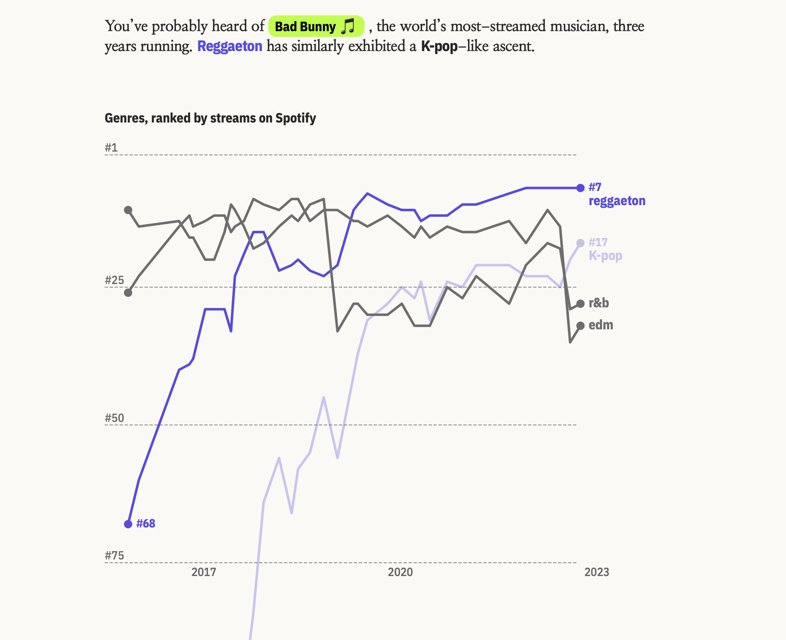
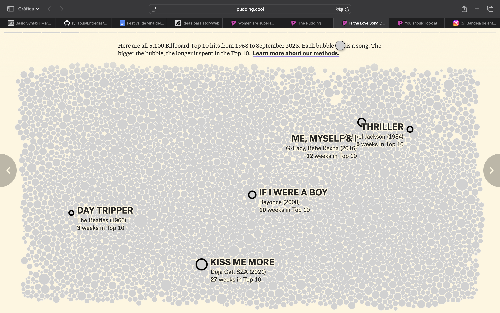

# Síntesis del proyecto: 

## Resumen del tema 
El proyecto analiza la relación entre la participación de artistas en el Festival de Viña del Mar y su popularidad, desde su primera edición en 1960 hasta la última realizada en 2025. Se busca comprender si el festival funciona como un indicador de éxito musical y cómo influye en la carrera de los artistas, evaluando el impacto de su show tanto a nivel nacional como internacional. En este sentido, es relevante observar qué ocurre con los artistas chilenos que han pasado por la Quinta Vergara, pues parece ser que para muchos de ellos la invitación al evento ha significado una plataforma de proyección para sus carreras musicales, tanto dentro como fuera del país. 

Además, se analiza el efecto que tiene el festival en artistas internacionales que ya cuentan con cierto reconocimiento previo. Casos como el de Luis Miguel o Shakira muestran que la presencia en el escenario viñamarino no solo refuerza su popularidad en Chile, sino que también contribuye a consolidar su lugar como artista de peso en el resto de América Latina. 

Por esto, analizaremos cómo varía el éxito entre artistas que llegan al festival con un gran público, comparándolos con artistas de trama emergente que inician su carrera en la competencia internacional, para luego presentarse en el escenario como artista principal. 

## Hipótesis 
Los artistas que se presentan en el Festival de Viña incrementan su popularidad después de participar en él.

## Antecedentes: 
Si bien suele destacarse el prestigio que posee el Festival de Viña del Mar a nivel continental, así como el logro que significa para los artistas presentarse en este escenario, no existe una gran cantidad de reportajes o artículos que analicen en profundidad el impacto real que tiene en la expansión de sus carreras. En la mayoría de los casos, se enfatiza el carácter simbólico de la Quinta Vergara como plataforma de consagración, pero se dejan de lado las consecuencias concretas (positivas o negativas) que puede traer para quienes suben al escenario viñamarino.

Los trabajos periodísticos que sí abordan el tema (como los adjuntados más abajo) suelen centrarse en un caso puntual (por ejemplo, un artista específico, como el caso de Luis Miguel, o una actuación en particular) sin consolidar el fenómeno como una tendencia más amplia que afecta a distintos músicos a lo largo de las décadas. De esta manera, abordan de forma superficial la relación entre Viña y la trayectoria artística, sin evaluar por qué ciertos cantantes logran consolidar sus carreras tras su paso por el evento, mientras que otros ven afectada su carrera o incluso enfrentan un retroceso en su popularidad (caso Maroon 5 o George Harris).

https://culturacolectiva.com/entretenimiento/musica/festival-vina-del-mar-artistas/

https://www.canal26.com/musica/2023/12/11/festival-de-vina-del-mar-la-cuna-de-un-sinfin-de-artistas-internacionales/

https://www.vogue.mx/estilo-de-vida/articulo/luis-miguel-en-vina-del-mar-1994-historia-en-la-vida-real

## Datos 

### Necesarios para probar la hipótesis
- Listado completo de artistas por edición (1960–2025)
- Listado de participantes finalistas en competencia internacional (1960 - 2025)
- Género musical de cada artista
- Nacionalidad de los artistas
- Número de veces que cada artista se ha presentado
- Ranking de los artistas antes y después del festival 
- Rating televisivo de audiencia del festival
### Datos que tenemos: 
- Listado completo de artistas 
- Género musical
- Nacionalidad
- Número de veces que cada artista se ha presentado
### Datos que no tenemos y cómo lo conseguiremos
- Ranking de los artistas antes y después del festival
- Los conseguiremos a través de una recopilación escrita en Excel, que contará con comparaciones de la popularidad del artista en reproducciones y ventas, según el año en que se hayan presentado. 
### Datos no públicos
- Archivo de rating CNTV (especialmente ediciones antiguas) 
- Datos confiables
- Carteles oficiales del festival
- Recopilados de medios de comunicación

## Preguntas a responder: 
1. ¿Existe una correlación entre la popularidad previa de un artista y su selección para el Festival de Viña?
2. ¿Los artistas incrementan su popularidad en Chile tras presentarse en el festival?
3. ¿Los artistas incrementan su popularidad a nivel latino tras presentarse en el festival?
4. ¿Qué géneros musicales y nacionalidades son más exitosos en términos de popularidad y repetición?
5. ¿Se observa alguna tendencia histórica en la relación entre popularidad y éxito en Viña?
6. ¿Qué artistas se consolidan como referentes culturales a través de la repetición en el festival y el incremento de su popularidad?

## Historial visual

La historia del festival ha estado ligada a la música y la televisión en Chile, convirtiéndose en un escenario clave para medir éxito e impacto cultural. Sin embargo, la mayoría de los análisis previos sobre Viña han sido cronológicos o anecdóticos, sin profundizar en los datos concretos que explican cómo la visibilidad del festival ha influido en la carrera de los artistas. Lo novedoso de este proyecto es que se propone comprobar con evidencia si Viña funciona como un medidor de popularidad y, al mismo tiempo, como un impulsor de carreras musicales, ofreciendo una mirada cuantitativa y comparativa que no ha sido explorada en profundidad.

Lo nuevo está en el enfoque de datos: no se trata solo de revisar la historia del festival, sino de medir concretamente la relación entre popularidad antes y después de presentarse en Viña, cruzando información sobre géneros, nacionalidad y repetición de artistas. Esto permitirá responder preguntas que generalmente se abordan desde la opinión o la memoria colectiva, dándole un sustento objetivo a nuestra pregunta narrativa: *¿Viña hace famosos a los artistas?*

Con esto en mente, imaginamos nuestro story web con los siguiente elementos gráficos: 

- Gráfica que diferencia artistas exitosos pre festival y artistas emergentes pre festival 

- Popularidad de los artistas luego de presentarse en el festival 

Top artistas más exitosos tras su pasada por el festival

Ejemplos:
https://pudding.cool/2023/07/songwriters/
https://pudding.cool/2024/11/love-songs/

## Resultados: 

### Mínimos: 
- Identificar artistas exitosos antes de su participación en Viña y comparar con aquellos que aumentaron su popularidad después del festival.
- Visualizar patrones generacionales por década 

### Máximos: 
- Comparación entre la popularidad previa de un artista y su selección para el festival, usando métricas como reproducciones, ventas o ratings televisivos.
- Medición precisa del aumento de popularidad después del festival, mostrando qué artistas se benefician más y en qué géneros.
- Identificación de patrones de éxito, es decir, qué combinaciones de popularidad previa, género y nacionalidad son más recurrentes en artistas exitosos.

## Base de datos:

En un archivo de Excel, recolectaremos los datos manualmente. Cada fila corresponderá a un artista, mientras que las columnas registrarán: el año de participación en el Festival de Viña del Mar, el género musical predominante, la nacionalidad del artista, y un indicador de su popularidad previa al festival (por ejemplo, reproducciones, ranking radial o premios obtenidos antes de Viña). 

También se incluirá una columna para medir la popularidad posterior a su presentación, a partir de métricas como aumento en ventas, reproducciones, giras o presencia en medios. De esta forma, podremos observar si los artistas ya eran populares antes de ser invitados o si su paso por el festival significó un punto de inflexión en su carrera. Ejemplo: Shakira en 1993, cuando se presentó como una artista emergente en la competencia, y luego regresó en 2000 como estrella internacional, evidenciando cómo su popularidad se consolidó después de haber pasado por el festival.

Links: 

https://www.memoriachilena.gob.cl/602/w3-article-96432.html
https://www.emol.com/especiales/vina2007/biografias.htm
https://sites.google.com/site/archivohistoricopatrimonial/noticias/coleccionaudiovisualfestivalinternacionaldelacanciondevinadelmar?authuser=0
https://www.last.fm/es/festival/435203+Festival+de+Vi%C3%B1a+del+Mar+2008
https://repositorio.uchile.cl/bitstream/handle/2250/134511/Contigo%20al%20fin%20del%20mundo_Una%20historia%20del%20Bolero%20en%20Chile.pdf;sequence=1
https://www.cntv.cl/wp-content/uploads/2020/04/audiencia_festival_vi__a_2011.pdf
https://es.scribd.com/document/683350354/El-Musiquero-71

